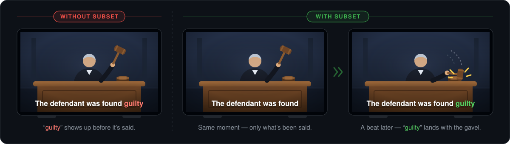

# Subset

**Offset subtitles that don't spoil everything.**

<p align="center">
  
</p>

Subtitles on TV shows and movies routinely appear *before* the words are
spoken. Instead of clarifying what you just heard, they spoil what you're
about to hear — the joke lands in text before the actor opens their mouth,
and once the words are on screen it's hard not to peek. Subset fixes this by
throwing the shipped subtitles away and regenerating captions live, from the
audio itself.

That design carries a structural guarantee: **captions derived from the audio
can trail it, but can never precede it.** The text is computed from the sound
you're hearing — it can't spoil the line any more than an echo can precede a
shout. In practice captions land a fraction of a second to ~2 seconds behind
speech, in the style of live-broadcast captions.

This is a proof of concept built for one living room, not a product. It works
surprisingly well.

## How it works

Your Mac sits between the video source and the TV:

```
┌──────────┐  HDMI   ┌────────────────────┐  USB 3   ┌─────────────────────────────┐
│ Apple TV ├────────►│ HDMI capture card  ├─────────►│ Mac                         │
└──────────┘         │ (UVC, e.g. MS2130) │          │                             │
                     └────────────────────┘          │  OBS: video + captions      │
                                                     │   ▲                         │
                                                     │   │ text (obs-websocket)    │
                                                     │  subset (Python)            │
                                                     │   │ 16 kHz mono PCM         │
                                                     │   ▼                         │
                                                     │  Deepgram ─or─ Gemini Live  │
                                                     └──────────────┬──────────────┘
                                                                    │ HDMI
                                                                    ▼
                                                                ┌──────┐
                                                                │  TV  │
                                                                └──────┘
```

The `subset` app captures the card's audio, downsamples it to 16 kHz mono,
streams it to a realtime STT engine (**Deepgram nova-3** or Google **Gemini
3.5 Transcribe Live** — switchable at runtime), folds interim and finalized
transcripts into roll-up captions, and pushes them into OBS over
obs-websocket. OBS composes Netflix-style captions (centered white bold text
with a drop shadow) over the captured video, and its fullscreen projector on
the Mac's HDMI output feeds the TV. The show's audio reaches the TV through
OBS audio monitoring.

## What I used

Nothing here is sacred — swap in equivalents freely (any UVC capture card,
any HDMI source, any Mac that runs OBS):

- A MacBook Pro (Apple Silicon, macOS 15)
- A generic UVC HDMI→USB3 capture card (a MacroSilicon **MS2130** stick
  sold as "Cam Link 4K", 1080p60)
- An Apple TV 4K as the video source
- A TV with a free HDMI input, and two decent HDMI cables
- [uv](https://docs.astral.sh/uv/), OBS Studio 30+
- An API key for at least one engine: [Deepgram](https://deepgram.com)
  and/or [Google AI Studio](https://aistudio.google.com) (Gemini)

Full details, wiring order, and source-device settings: **[docs/hardware.md](docs/hardware.md)**

## Setup

1. **Wire the hardware** — see [docs/hardware.md](docs/hardware.md).
2. **Install dependencies:**

   ```sh
   uv sync
   ```

3. **Add API keys** at the repo root (all `*-key.txt` files are git-ignored,
   and the app never prints their contents):
   - Deepgram: `deepgram-key.txt`
   - Gemini: `gemini-key.txt`

   Either the bare key on one line or a pasted console export block
   (`API Key: …`) works.
4. **Configure OBS** (WebSocket server, audio monitoring to the TV,
   fullscreen projector) — see **[docs/obs-setup.md](docs/obs-setup.md)**.
   The Subset scene itself is built automatically; you never assemble
   sources by hand.
5. Copy `.env.example` to `.env` and set `OBS_WS_PASSWORD`.

## Run

```sh
uv run subset --engine deepgram   # Deepgram engine
uv run subset                     # Gemini engine (the current default)
```

Ctrl+C stops the app and clears the captions. A stats line prints every 10
seconds so you can see pipeline health at a glance:

```
[subset  20.1s] send backlog 0.0s | interims 1.0/s, turnaround avg 0.02s max 0.04s | finals 0.3/s, ...
```

- **send backlog** — seconds of audio waiting to upload (should be ~0)
- **interims/finals per second** — how often the engine is updating text
- **turnaround** — age of the newest uploaded audio when a transcript
  arrived; the transcription round-trip (typically well under 0.2 s)

### Flags

| Flag | Default | Purpose |
|---|---|---|
| `--engine {gemini,deepgram}` | `gemini` (or `$SUBSET_ENGINE`) | transcription backend |
| `--model` | engine default | model id override |
| `--key-file` | engine default | API key file |
| `--no-obs` | off | transcribe to stdout only (no OBS needed) |
| `--verbose` | off | print interim hypotheses with turnaround |
| `--seconds N` | run forever | stop after N seconds |
| `--list-devices` | — | list audio input devices and exit |
| `--audio-device` / `--video-device` | `USB3.0 Audio` / `USB3.0 Video` | capture device name substrings |
| `--audio-out DEVICE` | off (OBS monitors) | play the show's audio straight to this output device through a drift-corrected buffer |
| `--audio-out-buffer-ms` | 100 | passthrough target depth (latency vs. resilience) |
| `--font-size` / `--max-lines` / `--max-chars` | 56 / 2 / 46 | caption geometry |
| `--obs-url` / `--obs-password` | `ws://127.0.0.1:4455` / `$OBS_WS_PASSWORD` | obs-websocket connection |

## Choosing an engine

Both engines get the same audio and drive the same captions; they differ in
temperament:

- **Deepgram nova-3**: extremely steady streaming with segment-level finals
  every few seconds via server-side endpointing; occasionally smudges hard
  proper nouns. No session time cap.
- **Gemini 3.5 Transcribe Live** (`gemini-3.5-transcribe-live`): strong
  vocabulary and proper nouns. Sessions cap at 10 minutes, so the app rotates
  them seamlessly (preferring a quiet moment); it also nudges finalization at
  natural breaths since the server otherwise only finalizes at long silences.

Either way, audio is transcribed in the cloud and billed per audio minute —
a movie night is 2–3 hours of streaming STT; check your provider's pricing.
If one provider is congested (new-model launch weeks are real), switch
engines with one flag. The app detects a stalled backend ("speech flowing
but no transcripts") and recycles the connection automatically.

**Privacy note:** the audio of whatever you're watching is streamed to the
transcription provider you select. Don't point it at anything you wouldn't
send to that provider.

## Troubleshooting

The three most common issues:

- **Black screen from the source** → HDCP negotiation or a marginal HDMI
  cable; see [docs/troubleshooting.md](docs/troubleshooting.md).
- **Captions sparse or absent while audio is clearly flowing** → the STT
  service is congested; watch for the app's "recycling session" message and
  consider the other engine.
- **No sound on the TV** → OBS monitoring device isn't set to the TV; see
  [docs/obs-setup.md](docs/obs-setup.md).

Everything else we've actually hit — display detection, audio blips, garbled
audio, doubled captions — is catalogued in
**[docs/troubleshooting.md](docs/troubleshooting.md)**.

## Architecture

```
src/subset/
  app.py          CLI, wiring, watchdogs, telemetry
  audio.py        Core Audio capture + 48→16 kHz FIR decimation
  captions.py     roll-up caption state (finals append, interim replaces)
  deepgram.py     Deepgram /v1/listen client (raw WebSocket)
  transcriber.py  Gemini Live client (session rotation, breath finalization)
  passthrough.py  card→TV audio bridge with silence-aligned drift correction
  obs.py          obs-websocket scene builder + caption pusher
```

Design decisions worth knowing before contributing:

- **Both engines reduce to two callbacks** — interim (replace current
  hypothesis) and final (append) — which is the entire engine abstraction.
- **Capture uses native Core Audio block sizes** (`blocksize=0`); device
  buffers are shared across every client of the device, and forcing large
  blocks degrades OBS's capture of the same card into audible hiccups.
- **Every stage has a liveness signal**: the capture watchdog reopens a
  stalled stream (display hot-plugs churn the device list), the sender never
  blocks forever on a silent queue, transcript starvation recycles the
  connection, and the caption pusher survives OBS restarts. Streaming
  failures are usually silences, not crashes — detect the absence of data.
- **Un-finalized text is promoted, never dropped**, when a session ends, so
  reconnects don't erase words from the screen.
- **Each caption line is its own OBS text source** anchored to the canvas
  centerline, because FreeType text sources can't center multi-line text.

## Limitations

- Proof of concept: one language track, one caption style, macOS only.
- Known issue: OBS's audio-monitoring path can blip briefly on rare
  occasions — the source's audio clock and the Mac's output clock drift
  independently, and OBS bridges them with blind buffer slips. Remedy:
  `--audio-out "<your TV>"` has the app carry audio to the TV itself
  through a buffer that corrects drift only during silence.
- Perceived caption lag is the transcription cadence (roughly 0.5–2 s);
  that's inherent to the no-spoiler design.
- HDCP: this project does not decrypt or circumvent copy protection. Whether
  protected content displays depends entirely on your source device and
  capture card's HDCP negotiation. Test with content you have the right to
  view and process.
- Live line-wrapping can't look ahead, so the bottom line occasionally
  starts with a lone word before growing — the one visual tell that the
  captions are born in real time.

Subset is not affiliated with Netflix, Elgato, Google, Deepgram, Apple, or
OBS; product names appear for identification only.

## License

[MIT](LICENSE)
